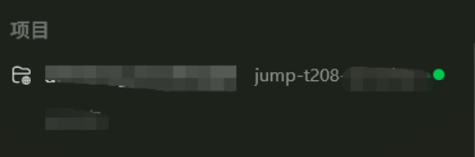
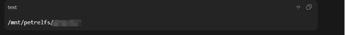
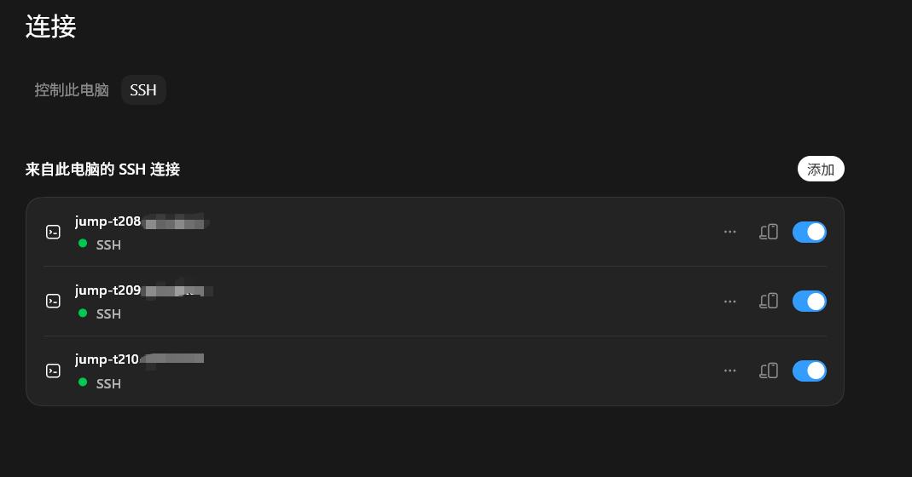
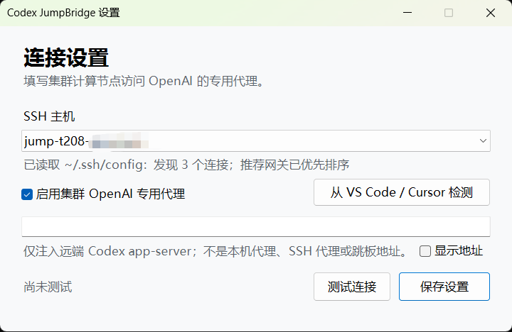
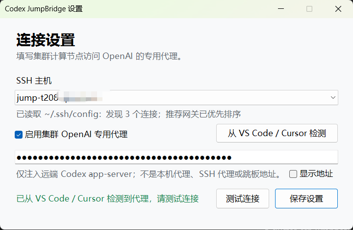

<div align="center">

# Codex JumpBridge

**让 Codex Desktop 稳定连接仅提供登录 Shell 的 T 集群 SSH 网关。**


**如果 JumpBridge 对你有帮助，请点一下右上角 Star，支持项目继续完善。**

</div>

Codex JumpBridge 是按需启动的 SSH 兼容层，不是后台服务。它把 Codex Desktop
的远程命令转换成 T 集群网关能够接受的 `sh + stdin`，并保持 app-server 的
双向数据流。安装时会自动启用 `~/.ssh/config` 中识别到的全部 T 集群跳板别名；
普通 SSH Host 继续由系统 OpenSSH 直连，不受影响。支持 Windows 与 macOS。
识别依据 SSH alias 的 `jump-t...` 命名或 `ssh -G` 展开后的多段 User 路由格式；
安装器不会记录、展示或提交跳板地址和后端节点地址。

## 验证效果

| SSH 项目在线 | 远端目录可访问 |
| --- | --- |
|  |  |

<p align="center">
  <strong>全部 SSH Host 均可识别，并可同时连接</strong><br>
  
</p>

## 如何安装

### 方式一：交给 Codex 安装（推荐）

在本机 Codex 中发送：

```text
请安装并启动 https://github.com/xkqin/codex-jumpbridge 。阅读 README 后自动判断 Windows/macOS，扫描 ~/.ssh/config，把符合 T 集群 alias 或多段 User 路由格式的全部 Host 一次配置完成。只检查 IdentityFile 是否存在，不读取私钥。提示我填写“集群计算节点访问 OpenAI 的专用代理”，不要使用或展示仓库内置地址；缺少远端运行文件时按 README 的 Q&A 引导安装 openai.chatgpt，不安装独立 CLI。最后逐个 Host 运行 doctor，全部 READY 才算完成。
```

Codex 会自动安装并打开平台原生设置页，然后按下面两步完成配置。

**完整安装顺序**

1. Codex 读取本仓库并判断当前是 Windows 还是 macOS。
2. 安装器扫描本机 `~/.ssh/config`，识别可用集群 Host，并检查 `IdentityFile` 是否存在。
3. 弹出 JumpBridge 设置 UI，用户选择要使用的 SSH Host。
4. 用户手动填写集群 OpenAI 专用代理，或从已连接的 VS Code/Cursor 中检测。
5. “远端 MCP”默认保持关闭；只有确认集群能访问全部 MCP 服务时才开启。
6. 点击“测试连接”；成功后点击“保存设置”。
7. 安装器准备远端 Codex 运行文件，并逐个 Host 执行 doctor，直到全部显示 `READY`。
8. 完全退出并重新打开 Codex Desktop，添加 SSH 项目并选择需要的远端目录。

> [!IMPORTANT]
> **旧频道跳走不等于丢失。** Codex 会按会话的工作目录自动归组；点击后从原项目
> 消失的频道，通常被移到了侧边栏中使用 `/mnt/petrelfs/...` 路径的同名项目下。
> 同一集群账号下，Codex 可以访问 VS Code/Cursor Codex 插件保存在远端
> `~/.codex` 中的全部旧对话记录。需要在当前项目加载这些记忆时，直接发送：
>
> ```text
> 请把我之前的vscode/cursor 的codex插件的旧对话记忆加载到这个项目里来
> ```

> [!IMPORTANT]
> **多个计算节点可以同时连接。** JumpBridge 与 VS Code/Cursor Codex 插件一样，直接
> 使用远端原生 `~/.codex`，不设置共享历史锁，也不会因为其他 Host 在线而返回退出码 87。
> 从 `v1.4.1` 升级时，安装器只把旧专用 master 中缺失的 session 补回 `~/.codex`；
> 不覆盖 VS Code/Cursor 已有记录，也不删除旧 master。

**1. 选择 SSH Host，填写集群专用代理**

<p align="center">
  
</p>

设置页会读取 `~/.ssh/config` 中的全部连接，并把推荐网关排在前面。选择要连接的
SSH Host 后，填写集群计算节点访问 OpenAI 的专用代理；输入框默认留空且地址被遮蔽。

**2. 可选：从 VS Code/Cursor 检测并验证**

<p align="center">
  
</p>

若该集群已在 VS Code/Cursor 中正常使用，可点击“从 VS Code / Cursor 检测”。检测
成功后先点“测试连接”，确认集群能够访问 OpenAI，再点“保存设置”。该代理只注入
远端 Codex app-server，不会成为本机代理、SSH 代理或跳板地址。

代理和远端运行文件都通过后，doctor 才会显示：

```text
[OK] Gateway shell bridge works
[OK] Remote home launcher and codex-code-mode-host are ready
[OK] Remote native ~/.codex home is ready (no history lock)
[OK] OpenAI route works (HTTP 401)
[OK] Codex Desktop startup gate and WebSocket upgrade work

Status: READY
```

### 方式二：下载安装程序

也可以打开 [GitHub Releases](https://github.com/xkqin/codex-jumpbridge/releases/latest)：

- **Windows 10/11：**下载并双击 `Codex-JumpBridge-Windows-v1.4.3.exe`。
- **macOS 11+：**下载 `Codex-JumpBridge-macOS-v1.4.3.dmg`，将 App 拖入“应用程序”后运行。

> [!WARNING]
> **内部使用版本仅进行 ad-hoc 签名，未进行 Apple Developer ID 公证。** 请只从本仓库 Release 下载，并先核对
> 同一 Release 中的 `SHA256SUMS.txt`。若公司杀毒软件、Windows SmartScreen 或
> macOS Gatekeeper 拦截，请仅允许本次下载的 JumpBridge 安装程序/App 及安装后的
> JumpBridge SSH wrapper。不要关闭杀毒软件，也不要放行整个下载目录或
> `~/.local/bin`。

升级已有版本时，请先完全退出 Codex Desktop，避免正在使用的 SSH wrapper 无法替换。
发布包不包含 Host、IP、代理地址或私钥。macOS 首次运行若被拦截，请在 Finder 中
右键 App 并选择“打开”。

## 使用前准备

1. Windows 10/11 或 macOS，并已安装 Codex Desktop。
2. 本机 `~/.ssh/config` 已配置可用的 T 集群跳板机 `Host`。
3. 每位用户都要有**自己的**密钥对，例如本机 `~/.ssh/id_rsa` 和 `id_rsa.pub`。
   `IdentityFile` 指向私钥，公钥按 T 集群/飞书文档登记。不要复制同事的私钥，
   也不要把私钥上传到集群共享目录、GitHub 或对话。
4. 从团队内部文档获取**集群计算节点访问 OpenAI 的专用代理**；本项目不内置或公开地址。
5. 远端 VS Code/Cursor 已安装 `openai.chatgpt` 扩展；不要求先登录。

安装器只检查 `IdentityFile` 引用的私钥文件是否存在，不读取文件内容。缺少时会
在终端或设置 UI 中停止并提示，不会尝试生成、复制或下载私钥。

> [!IMPORTANT]
> 这里的代理是**集群计算节点访问 OpenAI 的专用代理**，不是本机
> 代理、SSH 跳板地址，也不会把流量转回 `localhost`。JumpBridge 只把它注入
> 远端 Codex app-server，不修改集群 `.bashrc`，不影响训练、Git 或普通 SSH。

## 工作原理

Codex Desktop 通常通过标准 SSH `exec` 启动远端 app-server；T 集群网关更接近
“先进入 `sh`，再从 stdin 发送命令”，直接 `exec` 会卡住，端口转发也被禁用。
JumpBridge 不要求用户手动修改项目路径，也不改写普通 SSH 命令的工作目录。为保证远端
会话能够创建和续接，仅在启动 Codex app-server 时进入远端 `$HOME`；项目路径仍由 Codex
和集群网关管理。

Codex 需要的是**无 TTY 的原始双向数据流**：它执行类似 `ssh <Host> <command>`，
再通过 stdin/stdout 与 app-server 通信。T 集群账号不是普通计算节点 `sshd`，网关不接受
这种标准 exec channel，只提供登录 shell。此时运行 `tty` 通常会得到 `not a tty`；强制
`ssh -t` 也不能解决，因为 PTY 会加入终端控制和换行转换，破坏 app-server 的协议流，
而且仍绕不过网关不支持 exec/forward 的限制。JumpBridge 不申请 TTY，而是把请求改写为：

```text
Codex 的 ssh exec 请求 → 登录 T 集群 shell → 从 stdin 发送命令 → 保持原始双向流
```


JumpBridge 与 VS Code/Cursor 直接使用远端原生 `~/.codex`。每个计算节点各自在节点本地
短路径启动 app-server socket/PID/log，因此 208/209/210 等多个 Host 可以同时在线；
JumpBridge 不再添加历史互斥锁或专用运行数据库。升级时只迁移旧专用 master 中缺失的
session，已有 VS Code/Cursor 记录保持不变。

## 手动安装

**Windows PowerShell**

```powershell
.\windows\install.ps1

# 已知代理时可无交互安装
.\windows\install.ps1 -ProxyUrl '<集群提供的 OpenAI 专用代理 URL>'

~/.local/bin/codex-jumpbridge-setup.ps1
~/.local/bin/codex-jumpbridge-doctor.ps1 -HostAlias <SSH Host>
```

**macOS Terminal**

```bash
chmod +x macos/install.sh
./macos/install.sh

# 已知代理时可无交互安装
./macos/install.sh --proxy '<集群提供的 OpenAI 专用代理 URL>'

~/.local/bin/codex-jumpbridge-setup --host <SSH Host>
~/.local/bin/codex-jumpbridge-doctor --host <SSH Host>
```

安装成功后重启 Codex Desktop，在“设置 → 连接 → SSH”中添加同一个 Host，再选择
需要使用的远端目录。

## 安全边界

- 不读取、复制或上传 private key，也不修改 `~/.ssh/config`。
- 代理保存在本机并同步给识别出的 T 集群 Host，不接受 URL 内嵌用户名或密码。
- 不安装后台常驻服务；macOS 仅安装一个登录时执行一次的 LaunchAgent，使 Codex Desktop
  重启或重新登录后仍能找到 SSH wrapper。远端同步助手只随 SSH app-server 运行，不复制本机 Codex 历史。
- 不自动下载未知远端二进制；缺少编辑器运行包时明确引导用户安装。
- 安装前备份目标 SSH wrapper；Windows 用 `windows/uninstall.ps1`，macOS 用 `macos/uninstall.sh` 恢复。

> [!NOTE]
> 本项目针对 T 集群网关的实际行为开发，并非 OpenAI 官方项目。

## 常见问题（Q&A）

### Q：杀毒软件、SmartScreen 或 Gatekeeper 拦截怎么办？

先确认文件来自本仓库 Release，并用 `SHA256SUMS.txt` 核对哈希；确认一致后，仅允许
该安装程序/App 和安装后的 JumpBridge SSH wrapper 运行。不要关闭杀毒软件或放行
整个目录。

### Q：提示“缺少远端运行文件”怎么办？

> [!WARNING]
> **原因：**该 SSH 远端从未安装或尚未更新 VS Code/Cursor 的 `openai.chatgpt` 扩展。
> **处理：**在 VS Code/Cursor 的 SSH 远程窗口安装或更新 `@id:openai.chatgpt`，无需登录；
> 然后回到 Codex 说“继续安装 Codex JumpBridge”，让安装器重新准备并运行 doctor。

### Q：旧 channel 点击后从左侧消失怎么办？

这是 Codex 自动归组，不是删除。它通常被移到侧边栏里使用 `/mnt/petrelfs/...`
路径的同名项目下；展开那个项目继续找即可，旧对话加载方式见安装部分的 Important。

### Q：新建任务提示 Timeout，但旧对话还能继续怎么办？

通常是远端 MCP 服务在集群中不可达，导致 `thread/start` 超过 Codex Desktop 的等待时间。
重新打开 JumpBridge 设置，把“启用远端 MCP”关闭并重新连接。该操作只影响 SSH
app-server，不会删除或改写 `~/.codex/config.toml` 中的 MCP 配置。

### Q：一个 Host 已连接，其他 Host 显示失败怎么办？

`v1.4.2+` 不使用历史互斥锁，多个 Host 可以同时连接。若升级后仍看到退出码 87 或
“SSH 连接失败”，请完全退出并重新打开 Codex Desktop，确认 `ssh --codex-jumpbridge-version`
显示 `1.4.3`，再逐个运行 doctor 检查 SSH、远端运行文件和代理。

### Q：提示缺少 SSH 私钥怎么办？

每位用户都需要自己的私钥和已登记的对应公钥。确认 `IdentityFile` 指向本机存在的
私钥（如 `~/.ssh/id_rsa`）；不要复制同事的私钥，也不要把私钥上传到 GitHub。

### Q：自动扫描不到 T 集群 Host 怎么办？

如果 SSH alias 和 User 路由格式都被自定义，可显式指定本机 `~/.ssh/config` 中的别名：

- Windows：`.\windows\install.ps1 -HostAlias <SSH Host>`
- macOS：`./macos/install.sh --host <SSH Host>`

`HostAlias` 只写入本机 JumpBridge 配置，不会提交到仓库。
